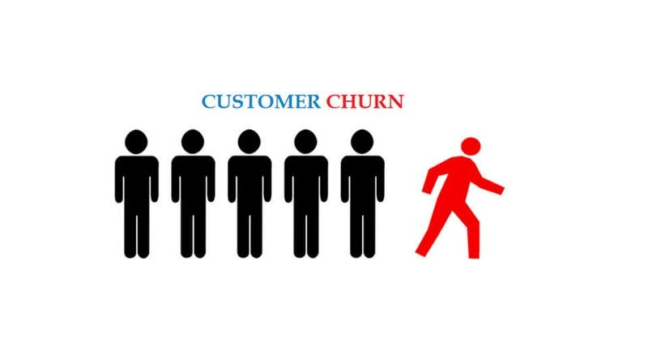
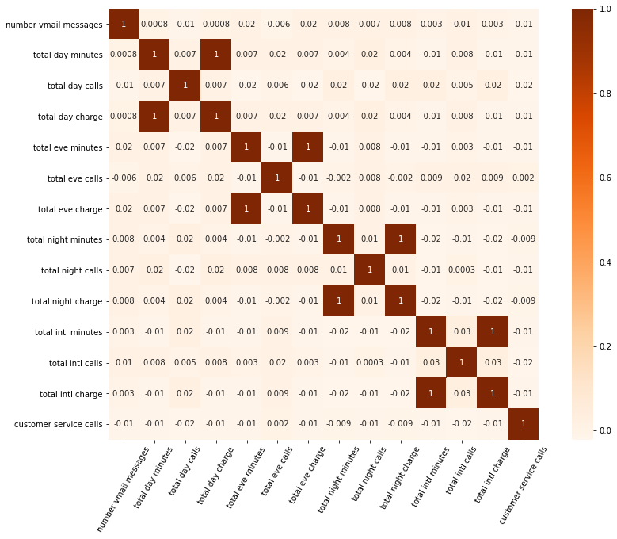

# PREDICTING CHURN IN TELECOM'S DATASET 

## **BUSINESS PROBLEM**
> 1. The business problem is to identify the customers who have a high likelihood of churning and to develop effective strategies to reduce or to retain churning customers.  
> 2. Identify factors that cause customer dissatisfaction and churn, such as network quality, customer service issues, or pricing concerns.   
> 3. To identify customer segments based on their behavior and likelihood of churn inorder to tailor marketing and retention strategies to each group's specific needs and preferences.
## **PROJECT OBJECTIVE**
> 1. **Churn Prediction**: To build predictive machine learning models that can predict which customers are likely to churn by using data to analyze customer features.
> 2. **Model Performance Assessment**: Comparing the machine learning models and determine which is the most accurate model in prediction.
> 3. **Increase Revenue**: Retaining more customers would allow for more revenue and also an increase in market share.
> 4. **Feature Insights**: Examining individual features will help gain insights on the causes of customer churn within the telecommunication company
## **DATA SOURCE**
> My project utilizes data obtained from [Kaggle](https://www.kaggle.com/datasets/becksddf/churn-in-telecoms-dataset/data), it is about customer churn in a telecommunication company.
## **METHODOLOGY**
* The project will use the CRISP-DM that is Cross-Industry Standard Process for Data Mining methodology, which has several stages:
   >> Business understanding  
   >> Data Understanding  
   >> Data preparation  
   >> Modeling  
   >> Evaluation  
   >> Deployment  
## **DATA PREPARATION**
> * Checked for missing values, duplicates and unique values in each column.  
> * Dropped some features: "Phone number", "Area", "State" and "Account Length".  
> * Target Variable: "Churn"
## **EXPLANATORY DATA ANALYSIS**
>                        MULTIVARIATE ANALYSIS
 
>                       BIVARIATE ANALYSIS OF CHURN FEATURE
> 
> 
> 
> 

## **DATA MODELLING**
> The models used are:
>   * Logistic Regression
>   * Decision Tree Classifier
>   * Random Tree Classifier  

> Random Tree Classifier has the highest Accuracy of 95% and also a high F1 score. It has a better balance between Precision and Recall
## **LIMITATIONS**
> 1. Complexity of Random Forest
> 2. The data may have unnoticed trends over time which might affect my analysis
> 3. Not all dataset features were useful in predicting churn leading to potential model inefficiencies.
> 4. Complex models like Random Forest are at a risk of overfitting reducing model robust validation and regularization.
## **CONCLUSION**
> **Model Performance**: I tasted 3 models with Random Forest Classifier emerging as the top performer, achieving a remarkable 95% accuracy and well-balanced precision and recall.

> **Key Features**: The analysis showed some influential features: "customer_service_calls", "total_day_minutes","total day charge", "total intl calls" and "total eve charge" highlighting their importance in predicting churn.

> In summary, the analysis recommends Random Forest Classifier for predicting customer churn.  

## **RECOMMENDATIONS**  
>  **Improve Customer Service**: 
 * High customer service calls correlate with churn.  
 * Reduce customer service calls and improve quality of customer service by offering comprehensive training to customer service representatives.
> **Pricing Structure Evaluation**:
 * Evaluate the pricing structure for day, evening, night, and international charges.  
 * Adjusting pricing plans or introducing discounted packages would address the concerns related to higher charges, which contribute to customer churning.
> **Engage with Clients likely to churn**:
 * Reach out to clients who have a high daily usage.
 * They have the most likelihood of churning.